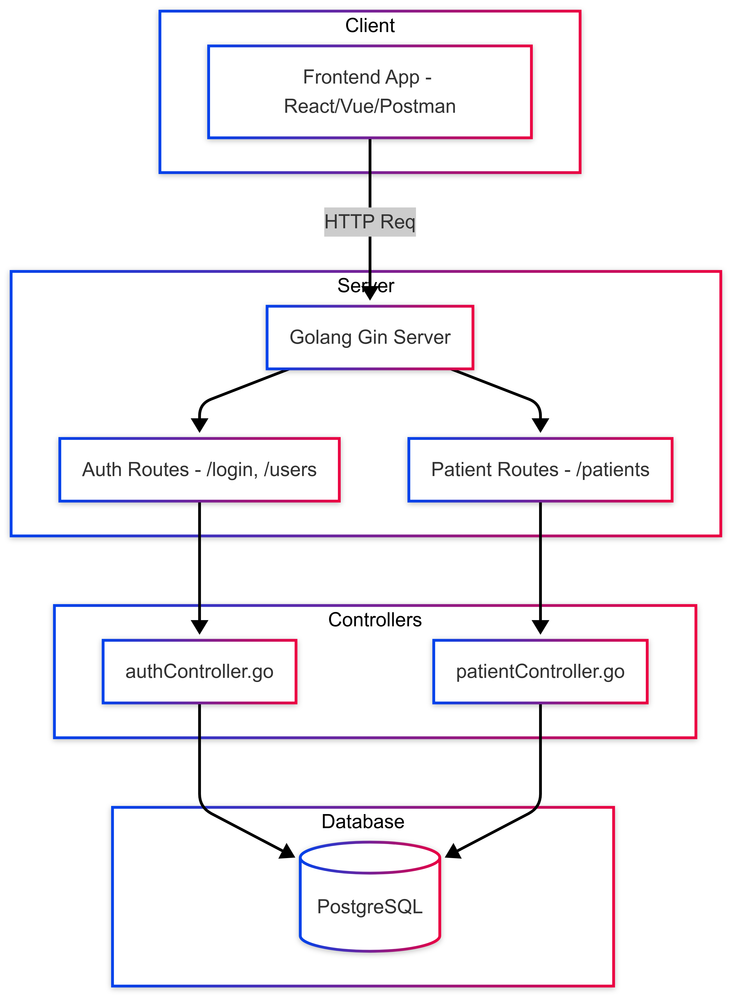

# 🏥 Patient Portal API

A secure, role-based hospital management backend API built using **Golang’s Gin web framework**. The system allows doctors, receptionists, to manage patient data efficiently. Data is persisted in a **serverless PostgreSQL** database hosted on [Neon.tech](https://neon.tech/).

---
## Flow Diagram

## Key Features

- JWT-based Authentication & Authorization
- Role-based Access Control: Admin, Doctor, Receptionist
- CRUD for Patient Records
- Middleware for Validation & Logging
- RESTful API structure with modular code design
- Hosted DB on [Neon.tech](https://neon.tech)

---

---

## 🛠️ Tech Stack  

| Technology            | Purpose                                                              |
|------------------------|----------------------------------------------------------------------|
| **Golang (Gin)**       | Fast, lightweight HTTP web framework for API development            |
| **Neon.tech**          | Serverless PostgreSQL hosting with connection pooling               |
| **PostgreSQL**         | Relational database to store users, roles, and patient data         |
| **JWT (github.com/golang-jwt/jwt)** | Secure token-based authentication                        |                   |
| **godotenv**           | Loads environment variables from `.env` file                        |

---

## 📥 API Endpoints

### Auth Routes

| METHOD | ENDPOINT        | DESCRIPTION                          |
|--------|------------------|--------------------------------------|
| POST   | `/api/login`     | Logs in a user, returns JWT token    |
| POST   | `/api/users`     | Create a new role (admin only)    |
| POST   | `/api/patients`  |  Create a new patient  |
| GET   | `/api/patients`  |  Get all patients  |
| GET   | `/api/patients/:id`  |  Get a single patient  |
| PUT   | `/api/patients/:id`  |  Update a patient  |
| DELETE   | `/api/patients/:id`  |  Delete a patient  |
#### Example Request for `/api/login`

```json
{
  "email": "doctor@hospital.com",
  "password": "password123"
}
```

#### Example Request for `/api/users`

```json
{
  "email": "receptionist@example.com",
  "password": "qwerty",
  "name": "Jane Smith",
  "role": "receptionist"
}
```
#### Example Request for `/api/patients` (POST)
```json
{
  "first_name": "John",
  "last_name": "Doe",
  "email": "john.doe@example.com",
  "phone": "9876543210",
  "date_of_birth": "1990-06-15",
  "gender": "male",
  "address": "123 Street, City",
  "medical_history": "Hypertension",
  "allergies": "Peanuts"
}
```
#### Example Request for `/api/patients/:id` (PUT)
```json
{
  "phone": "9876500000",
  "address": "Updated Address, New City",
  "medical_history": "Diabetes, Hypertension"
}
```
## Setting Up the Project  

To set up and run this project locally, follow these steps:  

### Clone the Repository  
First, clone the project from GitHub:  

```sh
git clone https://github.com/thecodephilic-guy/patient-portal.git
cd patient-portal
```

### Install Dependencies
```sh
go mod download
```

### Configure Environment Variables
Create a .env file in the root directory of the project:
```bash
touch .env
```
Paste the following into .env OR use .env.example instead (replace with your actual credentials):
```bash
PORT=8080
DATABASE_URL='your-database-url'
JWT_SECRET=your-secret-key
TOKEN_HOUR_LIFESPAN=24
```
🔐 Do NOT commit your .env file to GitHub. It contains sensitive credentials.

### Run the Server
```bash
go run .
```

Visit:
📍 http://127.0.0.1:8080/api/

## Testing the API
Use Postman, curl, or any REST client to test:

## Conclusion

This Patient Portal streamlines patient interactions, making healthcare access more efficient and transparent. Built with Go and PostgreSQL, it ensures fast, secure, and scalable performance for real-world medical systems.